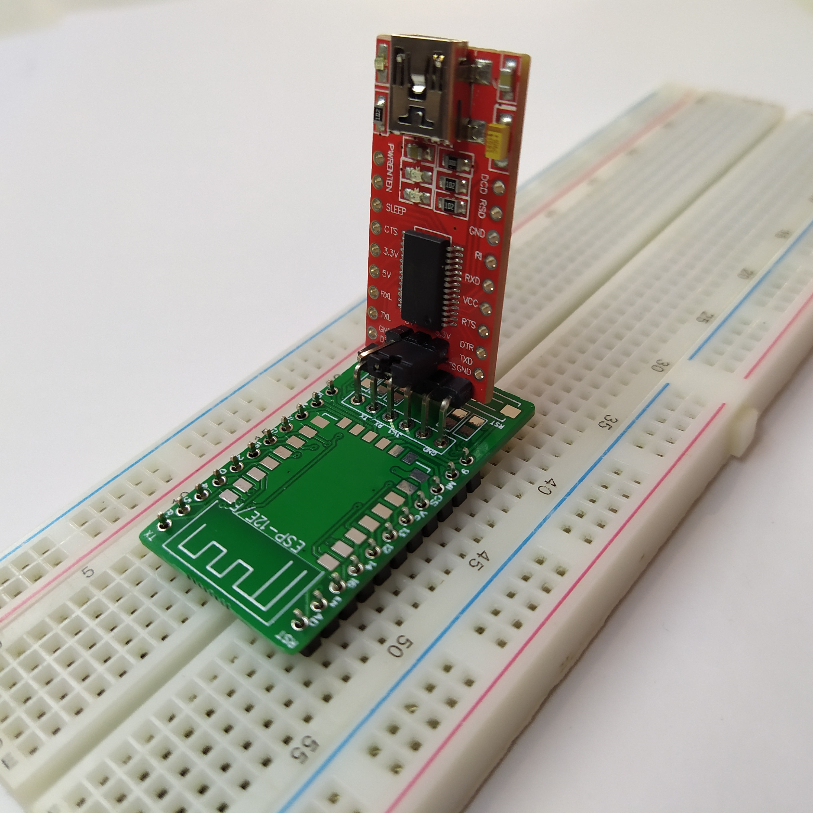
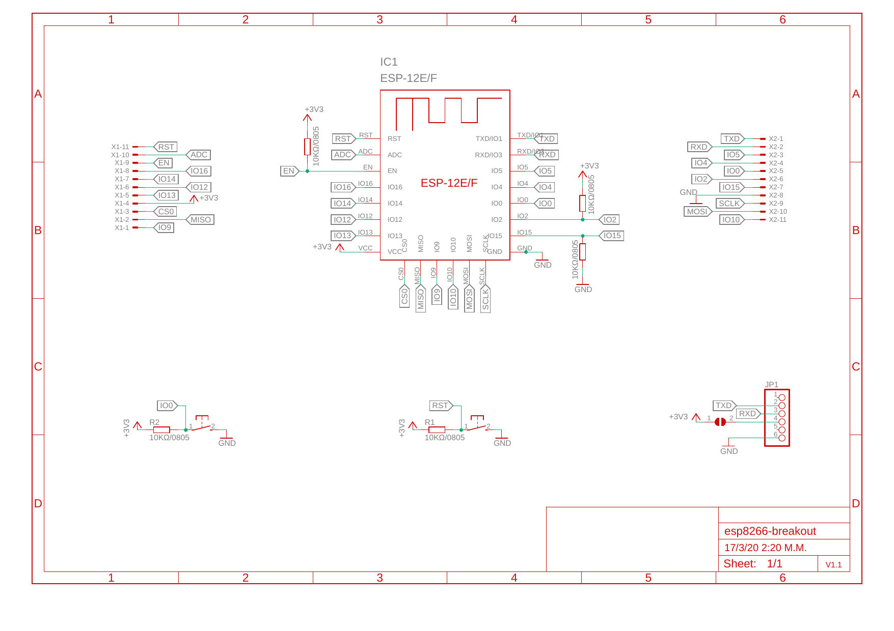
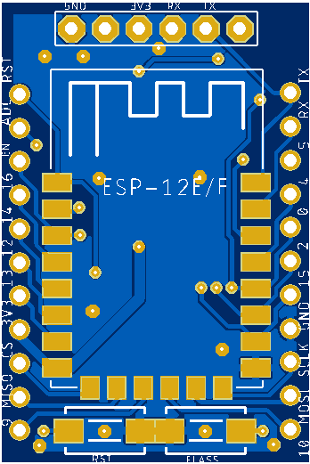
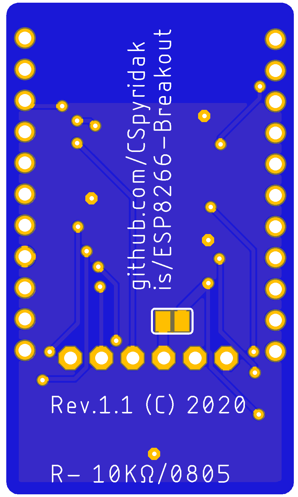
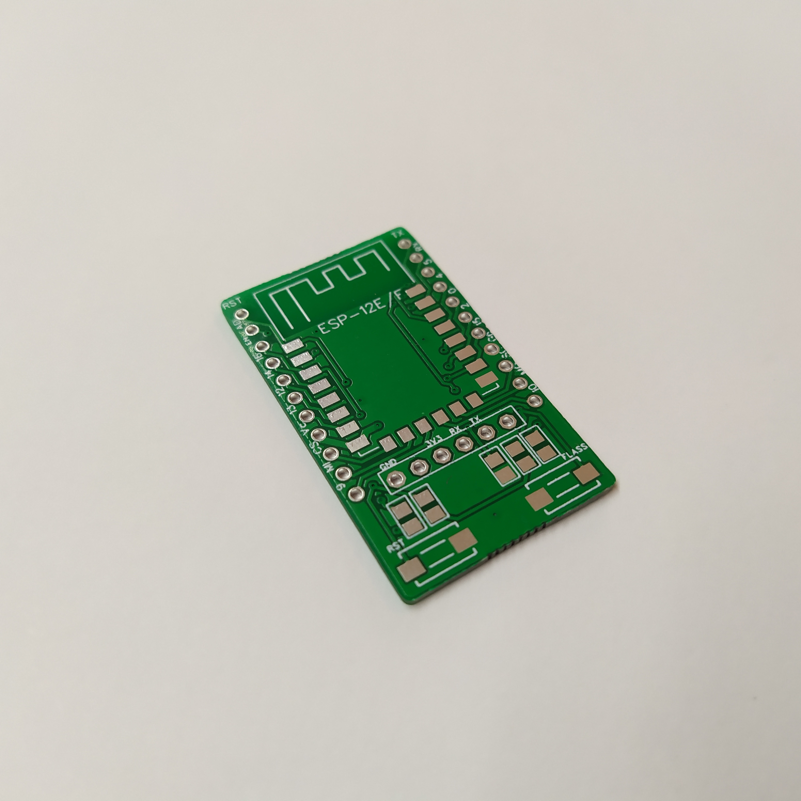

# ESP8266-Breakout  

A breadboard friendly ESP12E/F breakout with all I/O pins available, flash/reset buttons onboard, and place to directly use it with FTDI modules like [this](https://www.banggood.com/FT232RL-FTDI-USB-To-TTL-Serial-Converter-Adapter-Module-p-917226.html?rmmds=buy&cur_warehouse=CN).

### Schematic

|Top View             |  Bottom View              |
|:-------------------:|:-------------------------:|
|  |  |

### Sample

## Assembly 
| No  |   Component   |    Quantity      |
| --- | ------------- | ---------------- |
| 1.  |      ESP8266 - 12e/f         | 1 | 
| 2.  |    10KΩ 0805 smd resistors   | 5 | 
| 3.  |      SMD-SWITCH-6.2MM        | 2 |
| 4.  | Pin Header 1x11 Male 2.54 mm | 2 |

### Note
If you want to power up ESP8266 directly from FTDI board, just short the jumper that exists on the bottom side of the pcb.

## PCB CAD tool
This project was developed using free version of  [EAGLE 9.5.2](https://www.autodesk.com/products/eagle/overview)

Gerber files are available [here](pcb/gerber/)
