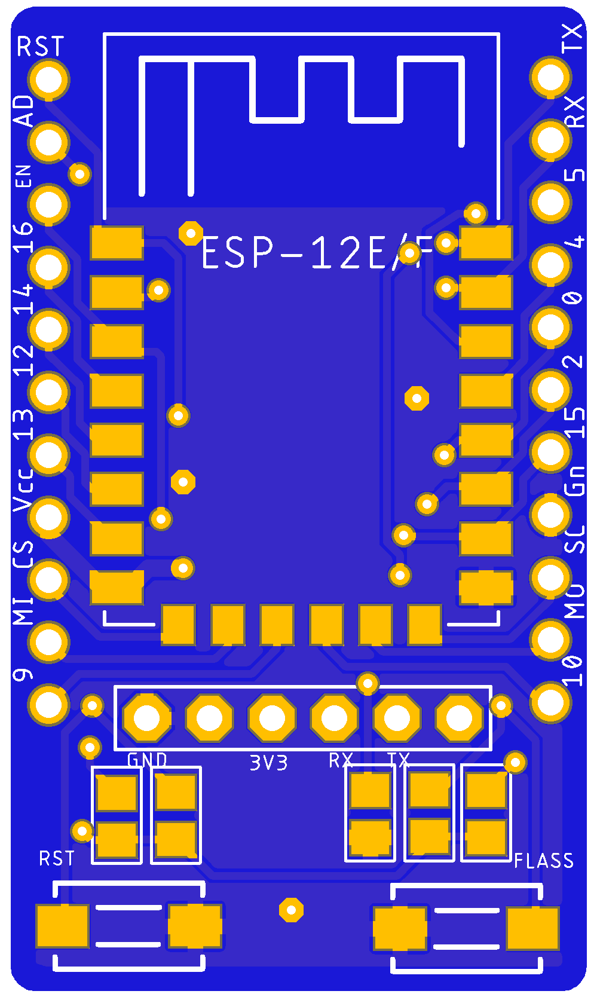

# ESP8266-Breakout

Custom ESP12E/F breakout with all pins available and flash/reset buttons onboard.

### Schematic

### Top

### Bottom

## PCB CAD tool

This project was developed using free version of  [EAGLE 9.5.2](https://www.autodesk.com/products/eagle/overview)